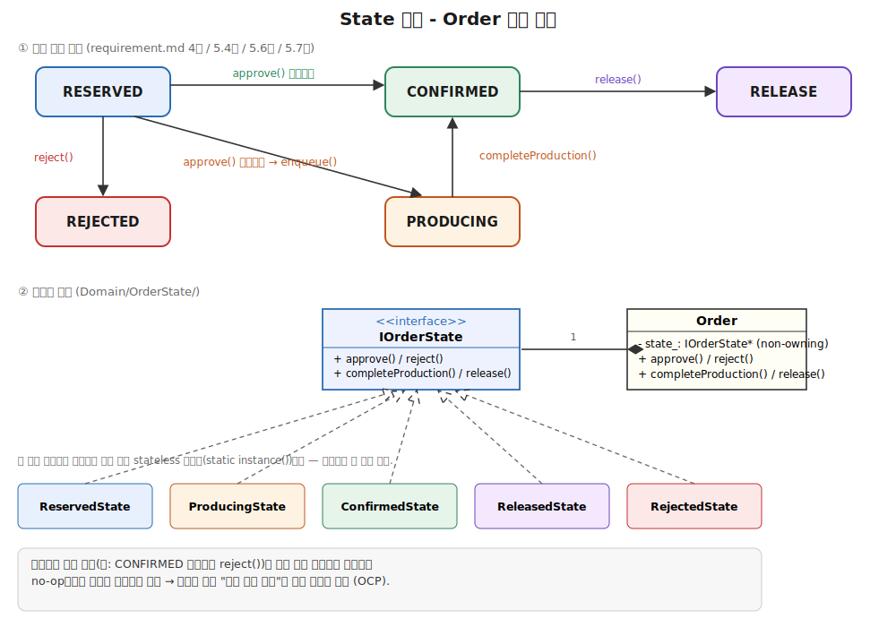
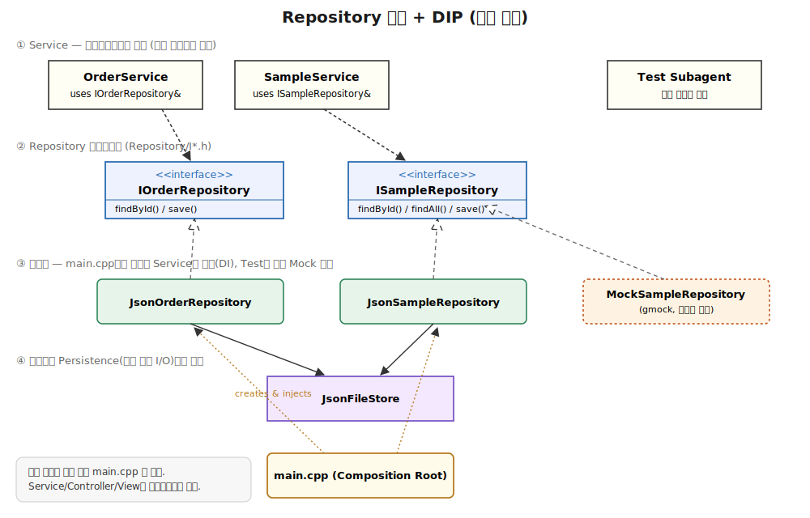
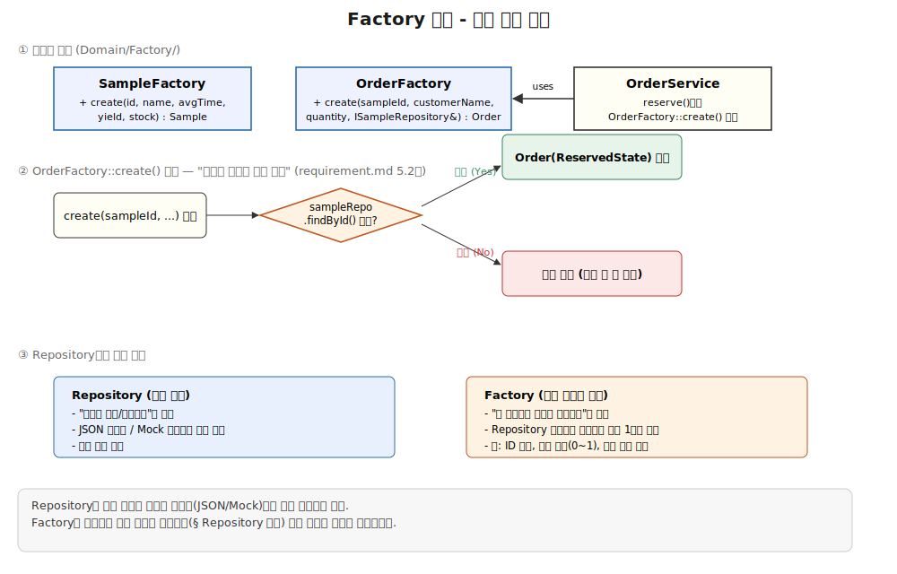
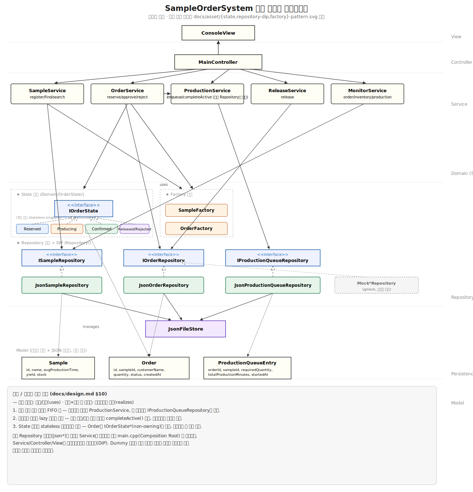

# 아키텍처 설계서 (Design) - SampleOrderSystem

관련 문서: [requirement.md](requirement.md) · [PRD.md](PRD.md) · [PLAN.md](PLAN.md)

이 문서는 PoC(미션1) 4가지 산출물의 검증 결과를 반영하여, 본 프로젝트(SampleOrderSystem)의 구체적인 아키텍처를 확정하기 위해 작성한다. PRD.md 6장("아키텍처 방향")에서 예고한 "PoC 완료 후 확정"에 해당하는 문서이며, PRD.md 6장은 이 문서가 확정되는 대로 요약 링크로 갱신한다.

## 1. PoC 산출물 반영 요약

| 항목 | 참고한 PoC | 그대로 가져오는 것 | 본 프로젝트에서 확장/변경할 것 |
|---|---|---|---|
| 패키지 구조 | ConsoleMVC-choisang-0707 | Model(데이터만)/View(입출력만)/Controller(흐름 제어) 3계층 분리 원칙, `ConsoleView` 네이밍 | 도메인 로직이 복잡해지므로 Controller와 Model 사이에 **Service**(승인/생산/출고 규칙), **Repository/Persistence**(파일 I/O) 계층을 추가하고, 여기에 OOP 디자인 패턴(§2)을 적용 |
| 데이터 영속성 | DataPersistence-choisang-0707 | `Persistence`(순수 파일 I/O) / `Repository`(메모리 상태 유지 + CRUD + 변경 시 즉시 저장) 계층 분리, nlohmann/json 단일 헤더 벤더링, `/utf-8` MSVC 옵션, 콘솔 UTF-8 설정 | `Sample` 단일 스키마 → `Sample`/`Order`/`ProductionQueueEntry` 3종 스키마로 확장, 파일 1개 → 데이터 종류가 늘어난 만큼 스키마 통합(§5), Repository를 **인터페이스 + 구현체**로 분리(§4.2) |
| 모니터링 | DataMonitor-choisang-0707 | 상태별 집계(REJECTED 제외), 재고 여유/부족/고갈 판정, 생산 진행률(wall-clock 기반 경과시간 재계산) 로직을 **Service 계층 함수**로 그대로 이식, `Order`/`ProductionQueueEntry` 스키마 | 별도 실행 파일이 아니라 본 시스템의 "모니터링" 메뉴로 통합(§7) |
| Dummy 데이터 생성 | DummyDataGenerator-choisang-0707 | 기존 파일 로드 → 메모리에 추가 → 즉시 저장(append) 방식, ID 채번 방식 | 별도 실행 파일이 아니라 개발/테스트 시 시드 데이터를 만드는 보조 스크립트/메뉴로 활용(제출용 프로덕션 메뉴에는 노출하지 않음) |

## 2. 설계 원칙 (Clean Code / OOP)

계층 분리(Layering)만으로는 "MVC 뼈대에 로직을 얹은 것"에 그친다. 도메인의 변화 지점(상태 전이, 생성 규칙)마다 아래 3가지 GoF/OOP 패턴을 적용해 **개방-폐쇄 원칙(OCP)**과 **의존 역전 원칙(DIP)**을 지킨다.

| 패턴 | 적용 대상 | 해결하는 문제 |
|---|---|---|
| **State** | `Order`의 상태·전이 규칙 | 상태별로 "무엇이 허용되는가"가 다른데, 이를 `if/switch`로 흩어놓으면 상태가 늘어날수록 모든 분기문을 찾아 고쳐야 함(OCP 위반) |
| **Repository + DIP** | 데이터 접근 계층 | Service가 JSON 파일이라는 구체적인 저장 방식에 직접 의존하면 테스트가 파일 I/O에 묶이고, 저장 방식을 바꿀 때 Service까지 고쳐야 함 |
| **Factory** | `Sample`/`Order` 생성 시 검증 | "등록된 시료(Sample)만 주문 가능"처럼 생성 시점에 지켜야 할 규칙을 생성자 밖으로 꺼내 한 곳에 모음 |

## 3. 패키지 구조

```
SampleOrderSystem/
├── vendor/nlohmann/json.hpp
├── Model/                                  # 데이터 구조 + JSON 매핑만 (로직 없음)
│   ├── Sample.h                            # id, name, avgProductionTime, yield, stock
│   ├── Order.h                             # id, sampleId, customerName, quantity, status, createdAt
│   └── ProductionQueueEntry.h              # orderId, sampleId, requiredQuantity, totalProductionMinutes, startedAt
├── Domain/
│   ├── OrderState/                         # ★ State 패턴
│   │   ├── IOrderState.h                   # approve()/reject()/completeProduction()/release() 인터페이스
│   │   ├── ReservedState.h/.cpp
│   │   ├── ProducingState.h/.cpp
│   │   ├── ConfirmedState.h/.cpp
│   │   ├── ReleasedState.h/.cpp
│   │   └── RejectedState.h/.cpp
│   └── Factory/                            # ★ Factory 패턴
│       ├── SampleFactory.h/.cpp            # Sample 생성 시 필드 검증
│       └── OrderFactory.h/.cpp             # "등록된 시료만 주문 가능" 등 생성 검증
├── Persistence/
│   └── JsonFileStore.h/.cpp                # 파일 load/save 전담 (DataPersistence PoC 이식)
├── Repository/                              # ★ Repository 패턴 + DIP
│   ├── ISampleRepository.h                 # 인터페이스 — Service는 이 인터페이스에만 의존
│   ├── IOrderRepository.h
│   ├── IProductionQueueRepository.h
│   ├── JsonSampleRepository.h/.cpp         # store.json 기반 구현체 (실 서비스에서 사용)
│   ├── JsonOrderRepository.h/.cpp
│   └── JsonProductionQueueRepository.h/.cpp
├── Service/                                 # 도메인 규칙 오케스트레이션 (Repository 인터페이스만 사용)
│   ├── SampleService.h/.cpp                # 등록/조회/검색, SampleFactory 사용
│   ├── OrderService.h/.cpp                 # 예약/승인/거절, OrderFactory + OrderState 사용
│   ├── ProductionService.h/.cpp            # 실생산량 계산 + IProductionQueueRepository를 통한 FIFO 큐 조작
│   ├── ReleaseService.h/.cpp               # 출고 처리
│   └── MonitorService.h/.cpp               # 상태별 집계, 재고 판정, 생산 진행률 (DataMonitor PoC 이식)
├── Controller/
│   └── MainController.h/.cpp               # 메인 메뉴 및 하위 메뉴 라우팅, Service 호출
├── View/
│   └── ConsoleView.h/.cpp                  # 콘솔 출력/입력 전담, 로직 없음 (ConsoleMVC PoC 원칙 유지)
├── Tests/                                   # GoogleTest/GoogleMock 유닛 테스트 (§11.1)
│   ├── Mocks/                               # Repository 인터페이스별 gmock Mock 클래스
│   └── OrderServiceTest.cpp                 # 등
├── data/
│   └── store.json
├── packages.config                          # NuGet: gmock (§11.1)
└── main.cpp                                 # Release: 구체 Repository 구현체를 생성해 Service에 주입(DI, 유일하게 구체 타입을 아는 지점) / Debug: gmock 테스트 러너 (§11.1)
```

- Controller는 여전히 "Service를 통해서만" 데이터를 조작한다(ConsoleMVC PoC 원칙 계승). 다만 Service 내부는 이제 `if/switch` 뭉치가 아니라 `Domain/*`의 State·Factory 객체에 위임하는 얇은 오케스트레이터가 된다(단, FIFO 큐 스케줄링 로직 자체는 별도 Domain 객체로 분리하지 않고 `ProductionService`에 직접 구현한다 — §2 참고. 큐 데이터 접근은 다른 Service와 동일하게 Repository를 통한다).
- **구체 클래스를 아는 곳은 `main.cpp` 한 곳뿐**이다(`JsonSampleRepository` 등을 생성해 Service 생성자에 주입). Service/Controller/View는 인터페이스(`ISampleRepository` 등)만 알아 DIP를 지킨다. Test 서브에이전트는 이 인터페이스에 대한 gmock Mock 클래스를 만들어 파일 I/O 없이 단위 테스트를 작성할 수 있다(§11.1).

## 4. 디자인 패턴 상세

### 4.1 State 패턴 — `Order` 상태 전이



```cpp
class IOrderState {
public:
    virtual ~IOrderState() = default;
    virtual IOrderState& approve(Order& order, SampleService&, ProductionService&) const = 0;
    virtual IOrderState& reject(Order& order) const = 0;
    virtual IOrderState& completeProduction(Order& order, SampleService&) const = 0;
    virtual IOrderState& release(Order& order) const = 0;
    virtual OrderStatus statusCode() const = 0;
};

class ReservedState : public IOrderState {
public:
    static IOrderState& instance();   // stateless 싱글턴 (§10 결정)
    // ...
};
```

- `ReservedState::approve()`: `SampleService`에서 현재 재고를 확인 → 충당 가능하면 즉시 차감 후 `ConfirmedState::instance()`를 반환, 부족하면 `ProductionService::enqueue()` 호출 후 `ProducingState::instance()`를 반환.
- `ReservedState::reject()`: `RejectedState::instance()` 반환. 다른 상태(`ConfirmedState`, `ProducingState` 등)의 `reject()`는 아무 것도 하지 않고 자기 자신(`*this`)을 반환하거나 예외를 던져(허용되지 않는 전이) "RESERVED 상태에서만 거절 가능"이라는 규칙을 타입 시스템 레벨에서 강제한다.
- `ProducingState::completeProduction()`만 실제로 동작하고 나머지 상태는 no-op — "생산 중 상태에서만 생산완료 처리가 의미 있다"는 규칙이 코드 구조 자체로 드러난다.
- `Order`는 현재 상태를 non-owning 참조/포인터(`IOrderState*`)로만 가리키고, `Order::status()`는 `state_->statusCode()`를 그대로 리턴 — JSON 직렬화 시에는 `statusCode()`만 문자열로 저장(§5 스키마는 변경 없음, State 패턴은 순수 인메모리 구조). 각 State 클래스는 인스턴스 필드가 없는 stateless 싱글턴이라 힙 할당이 발생하지 않는다(§10 결정).
- **장점**: 새로운 전이 규칙이 추가돼도(예: "CONFIRMED에서도 특정 조건이면 거절 가능") 해당 상태 클래스 하나만 고치면 되고, 다른 상태 클래스는 건드릴 필요가 없다(OCP).
- **트레이드오프**: 상태가 5개뿐이라 클래스 수(5개 + 인터페이스 1개)가 다소 늘어난다. 다만 requirement.md 5.6절의 승인/생산/출고 규칙이 상태마다 뚜렷이 다르므로, 이 프로젝트에서는 실익이 비용보다 크다고 판단했다.

### 4.2 Repository 패턴 + DIP



```cpp
class ISampleRepository {
public:
    virtual ~ISampleRepository() = default;
    virtual std::optional<Sample> findById(const std::string& id) const = 0;
    virtual std::vector<Sample> findAll() const = 0;
    virtual void save(const Sample& sample) = 0;   // 변경 시 즉시 영속화 (DataPersistence PoC 원칙 계승)
};

class JsonSampleRepository : public ISampleRepository {
    JsonFileStore& store_;   // Persistence 계층에만 의존, Service를 모름
    // ...
};
```

- `SampleService`, `OrderService` 등은 생성자에서 `ISampleRepository&`(인터페이스 참조)만 받는다. `main.cpp`에서 `JsonSampleRepository` 인스턴스를 만들어 주입한다(생성자 주입, DI 컨테이너 없이 수동 DI로 충분한 규모).
- Test 서브에이전트는 GoogleMock(`gmock`)으로 각 Repository 인터페이스의 Mock 클래스(`MockSampleRepository : public ISampleRepository`, `MOCK_METHOD`로 `findById`/`findAll`/`save` 스텁)를 만들어 `OrderService::approve()`의 재고 차감 로직, `IOrderState` 전이 로직 등을 파일 I/O 없이 검증할 수 있다(§11 참고).

### 4.3 생산 큐 — `ProductionService`

```cpp
class ProductionService {
public:
    explicit ProductionService(IProductionQueueRepository& queueRepo, ISampleRepository& sampleRepo);

    void enqueue(ProductionQueueEntry entry);          // queueRepo에 append, 비어 있었으면 즉시 시작 처리
    std::optional<ProductionQueueEntry> peekActive() const;  // queueRepo.findAll()의 0번째 (큐 head)
    void completeActive();                              // head 완료 처리 후 queueRepo에서 제거 (lazy 호출, §10)
private:
    IProductionQueueRepository& queueRepo_;             // 단일 글로벌 FIFO 큐 (§10 결정) — 진실 공급원은 항상 Repository/JSON
    ISampleRepository& sampleRepo_;                     // 완료 시 Sample.stock 반영용
};
```

`ProductionService`는 다른 Service와 동일하게 큐 상태를 자체 멤버(`std::deque` 등)로 따로 들고 있지 않고 **`IProductionQueueRepository`를 통해서만** 읽고 쓴다(§4.2 Repository+DIP 원칙 그대로 적용). 인메모리 사본을 별도로 두면 파일이 외부에서 바뀌었을 때 어느 쪽이 진짜인지 불명확해지므로, JSON(Repository)이 항상 단일 진실 공급원이다.

### 4.4 Factory 패턴 — 생성 시점 검증



```cpp
class OrderFactory {
public:
    static Order create(const std::string& sampleId, const std::string& customerName,
                         int quantity, const ISampleRepository& sampleRepo);
    // sampleRepo.findById(sampleId)가 없으면 예외 — "등록된 시료만 주문 가능"(requirement.md 5.2절)
};
```

- `SampleFactory::create`: 시료 ID 중복, 평균 생산시간/수율의 유효 범위(0 초과, 수율 0~1) 등 "생성 시점에만 검사하면 되는 불변식"을 한 곳에 모은다.
- `OrderFactory::create`: `sampleId`가 `ISampleRepository`에 존재하는지 검사 후 `Order`를 `RESERVED` 상태(`ReservedState`)로 생성.
- **Repository의 단순 `create()`와의 차이**: Repository는 "저장"만 책임지고, Factory는 "이 저장소 상태에서 이 객체를 만드는 것이 유효한가"라는 도메인 규칙을 책임진다 — Repository에 검증 로직이 섞이면 저장소 구현체(JSON/Mock)마다 검증을 중복 구현해야 하므로 Factory로 분리했다.

## 5. 데이터 모델 및 JSON 스키마

DataPersistence PoC는 `Sample`만, DataMonitor/DummyDataGenerator PoC는 `Sample`+`Order`+`ProductionQueueEntry` 3종을 한 파일에 담았다. 두 PoC(모니터링·더미생성) 간 실제 연동이 검증된 **DataMonitor/DummyDataGenerator의 스키마를 그대로 채택**하고, 파일명만 `store.json`으로 통일한다. State/Factory 패턴은 순수 인메모리 구조이므로 JSON 스키마 자체에는 영향을 주지 않는다 — 직렬화 시에는 `Order.status`를 문자열로, `productionQueue`를 배열로 저장하는 것은 PoC와 동일하다.

```json
{
  "samples": [
    { "id": "S1", "name": "WaferA", "avgProductionTime": 2.0, "yield": 0.9, "stock": 5 }
  ],
  "orders": [
    { "id": "O1", "sampleId": "S1", "customerName": "홍길동", "quantity": 3, "status": "RESERVED", "createdAt": "2026-07-15 09:00:00" }
  ],
  "productionQueue": [
    { "orderId": "O2", "sampleId": "S2", "requiredQuantity": 13, "totalProductionMinutes": 45.5, "startedAt": "2026-07-15 11:00:00" }
  ]
}
```

- `Sample`: DataPersistence PoC의 필드(`id`, `name`, `avgProductionTime`, `yield`, `stock`)를 그대로 유지.
- `Order.status`: `RESERVED` / `PRODUCING` / `CONFIRMED` / `RELEASE` / `REJECTED` (requirement.md 4절). 인메모리에서는 `IOrderState` 구현체가 이 값을 결정한다(§4.1).
- `productionQueue`는 **배열 순서 자체가 FIFO 순서**이며, 0번째 항목만 `startedAt`이 채워져 있으면 "현재 생산 중", 나머지는 "대기 중"이다(DataMonitor PoC 관례, `ProductionService`가 이 규약을 직접 구현).
- `requiredQuantity`/`totalProductionMinutes`는 승인 시점에 `ProductionService::enqueue`가 직접 계산해서 저장한다(§6). 모니터링 화면은 저장된 값을 그대로 읽기만 한다는 점은 PoC와 동일하다.

## 6. 핵심 비즈니스 규칙 구현 위치

CLAUDE.md/PRD.md 4장의 규칙을 `OrderService`/`ProductionService`와 §4의 패턴 객체에 다음과 같이 배치한다.

1. **승인 처리 (`OrderService::approve` → `ReservedState::approve`)**
   - 현재 `Sample.stock`과 주문 수량을 비교.
   - 재고로 충당 가능한 만큼(min(stock, quantity))은 **승인 즉시** `Sample.stock`에서 차감.
   - 남은 부족분(quantity - min(stock, quantity)) > 0이면 `ProductionService::enqueue` 호출, 상태는 `ProducingState`로 전이.
   - 부족분이 0이면 상태가 바로 `ConfirmedState`로 전이.
   - **재고 확인 시 `productionQueue`는 절대 조회하지 않는다** — 오직 `Sample.stock`의 현재 값만 사용 (requirement.md 5.6절 사례2 근거).
2. **생산 큐 등록/완료 (`ProductionService`)**
   - `enqueue`: `requiredQuantity = ceil(부족분 / yield)`, `totalProductionMinutes = avgProductionTime × requiredQuantity` 계산 후 큐 끝에 추가. 큐가 비어 있었다면 `startedAt`을 현재 wall-clock 시각으로 채워 "즉시 생산 시작" 처리.
   - `completeActive` (모니터링/생산 라인 메뉴 진입 시 또는 승인 처리 시점에 호출): 큐 head의 `startedAt` + `totalProductionMinutes`가 현재 시각을 지났으면 완료 처리 — `requiredQuantity` 전량을 **수율 재적용 없이** `Sample.stock`에 일괄 반영(규칙 4) → 해당 주문이 `ProducingState::completeProduction()`을 통해 `ConfirmedState`로 전이 → 큐에서 제거 → 다음 항목의 `startedAt` 시작.
   - 경과 시간은 DataMonitor PoC와 동일하게 `startedAt` 문자열만 영속 저장하고, 조회 시점마다 `now - startedAt`으로 재계산한다(재시작해도 경과 시간 자동 복원, 규칙 3).
3. **거절 처리 (`OrderService::reject` → `ReservedState::reject`)**: 재고/생산 큐에 영향 없이 `RejectedState`로 전이. `ReservedState`가 아닌 다른 상태에서 `reject()`를 호출하면 State 패턴 구조상 아무 효과가 없거나 예외("이 상태에서는 거절 불가")를 던진다.
4. **출고 처리 (`ReleaseService::release` → `ConfirmedState::release`)**: `ConfirmedState`에서만 `ReleasedState`로 전이 가능. 재고는 승인 시점에 이미 차감되었으므로 출고 시점에는 재고를 건드리지 않는다.
5. **모니터링 (`MonitorService`)**: DataMonitor PoC의 `OrderMonitor`(REJECTED 제외 집계) / `InventoryMonitor`(여유·부족·고갈 판정) / `ProductionMonitor`(진행률 계산) 로직을 그대로 이식. "대기 수요" 기준은 PoC와 동일하게 RESERVED 주문 수량 합으로 정의(§8 참고).

## 7. 메뉴 구성 (Controller 라우팅)

requirement.md 5.1절 메인 메뉴를 그대로 따른다. 데이터 모니터링/Dummy 데이터 생성 PoC는 **별도 실행 파일이 아니라 본 시스템 메뉴에 통합**한다(PRD.md 6장 방향과 일치).

| 메뉴 | 대응 Service | 대응 Phase(PLAN.md) |
|---|---|---|
| 시료 관리 | SampleService | Phase 1 |
| 주문 (접수/승인/거절) | OrderService, ProductionService | Phase 2, Phase 3 |
| 모니터링 | MonitorService | Phase 5 |
| 출고 처리 | ReleaseService | Phase 4 |
| 생산 라인 | ProductionService, MonitorService | Phase 3 |

Dummy 데이터 생성 기능은 제출용 메인 메뉴에는 노출하지 않고, 개발/테스트 편의를 위한 별도 진입점(예: 커맨드라인 인자 `--seed` 또는 개발용 서브메뉴)으로만 제공한다 — DummyDataGenerator PoC의 생성 규칙(랜덤 시료/주문, ID 이어채번)을 `Repository`의 테스트 헬퍼 또는 test Subagent의 TestCase 픽스처 생성에 재사용한다.

## 8. PoC에서 발견된 이슈 반영 방안

각 PoC README의 "발견한 이슈/설계 대안"을 본 프로젝트에서 다음과 같이 처리한다.

| 이슈 (출처 PoC) | 본 프로젝트 반영 |
|---|---|
| 표준입력 EOF 시 무한 루프 (DataMonitor) | `ConsoleView`의 입력 함수에서 `!std::cin` 체크를 공통 유틸로 만들어 모든 메뉴 루프에 적용 |
| 한글 폭 정렬(`std::setw`가 바이트 기준) (DataMonitor) | 표 형태 출력 시 고정폭 정렬 대신 구분자 기반 출력을 기본으로 채택. 표 정렬이 꼭 필요하면 문자당 표시폭 2로 계산하는 유틸 도입 |
| 파일 손상/스키마 불일치 시 무언의 실패 (DataMonitor) | `JsonFileStore::load` 실패 시 `false`만 반환하는 대신, Controller가 이를 받아 "데이터 파일 로드 실패" 배너를 View에 출력하도록 계약 변경 |
| "대기 수요" 정의(RESERVED 합 기준)가 설계 결정 사항 (DataMonitor) | 이 정의를 기본값으로 채택하고 확정. 승인/생산 시점에 이미 재고가 반영된 CONFIRMED/PRODUCING 주문은 대기 수요에서 제외하는 이유를 §6과 연결해 문서화 |
| PRODUCING 더미 주문의 "부족분=주문수량 전체" 단순화 (DummyDataGenerator) | 실제 승인 로직(`ReservedState::approve`)은 이 단순화를 사용하지 않고 §6의 실제 재고 차감 규칙을 따른다. Dummy 생성 도구는 테스트 픽스처 용도로만 남긴다 |
| ID 채번 방식(접미사 파싱)의 한계 (DummyDataGenerator) | 본 프로젝트도 동일한 `S{n}`/`O{n}` 채번 방식을 기본으로 유지하되, Repository 구현체가 채번을 전담해 Service/Domain 계층이 ID 형식을 직접 알 필요 없게 캡슐화 |

## 9. Phase 매핑 (PLAN.md 연계)

- **Phase 0**: 본 문서(§3~5)의 패키지 구조·스키마·패턴 골격(인터페이스 정의 포함)을 실제 코드로 이식(PoC → 본 프로젝트), Persistence/Repository 계층 셋업, 테스트 하니스 셋업(§11 — `packages.config`로 gmock NuGet 패키지 연결, `main.cpp`의 Debug/Release 진입점 분기, `/system-test` 스모크 확인 완료).
- **Phase 1**: `SampleService` + `SampleFactory` + 시료 관리 메뉴.
- **Phase 2**: `OrderService::reserve` + `OrderFactory` + `ReservedState` + 주문 접수 메뉴.
- **Phase 3**: `IOrderState` 전체 구현(승인/거절 전이) + `ProductionService`(실생산량 계산, FIFO 큐, 생산완료 처리) — requirement.md 사례1/사례2를 반드시 테스트로 검증.
- **Phase 4**: `ReleaseService` + `ConfirmedState::release`.
- **Phase 5**: `MonitorService` + 모니터링 메뉴.

## 10. 결정 사항 (구현 착수 전 확정)

- **생산 큐는 단일 글로벌 FIFO 큐로 확정한다.**
- **생산완료 처리는 lazy 체크로 확정한다.** 모니터링/생산 라인 조회, 승인 처리 등 메뉴 진입 시점에 `completeActive()`를 호출해 "그 시점 기준으로" 완료 여부를 계산한다. 별도 백그라운드 스레드는 콘솔 앱에 불필요한 동시성(레이스 컨디션, 종료 처리) 리스크를 끌어들이므로 채택하지 않는다. PoC(DataMonitor)에서 이미 이 방식으로 wall-clock 경과 시간 복원을 검증했다.
- **State 객체는 Stateless Singleton으로 확정한다.** `ReservedState`/`ProducingState` 등은 인스턴스 필드가 없는 순수 행동 객체이므로, 매 전이마다 `std::unique_ptr`로 새로 힙 할당하지 않고 각 상태를 `static` 싱글턴(예: `ReservedState::instance()`)으로 둔다. `Order`는 현재 상태를 non-owning 참조/포인터(`IOrderState*` 또는 `IOrderState&`)로만 가리키며, 전이 시 다른 싱글턴의 참조로 교체한다. 이는 GoF State 패턴의 전형적인 구현이며 불필요한 할당·해제를 없앤다.

전체 클래스 구조는 아래 다이어그램을 참고한다.



## 11. 테스트 하니스 (2계층)

PRD.md 8장 품질 기준의 "Harness 도입"을 아래 2계층으로 구성한다. 어느 하나로 대체되지 않고 서로 보완한다.

| 계층 | 대상 | 도구 | 실패 시 알 수 있는 것 |
|---|---|---|---|
| 유닛 테스트 | `Domain/*`(State 전이, Factory 검증), `Service/*`(재고 차감·실생산량 계산 등) | GoogleTest/GoogleMock (`gmock`) | 어느 클래스·메서드가 잘못됐는지 바로 특정 |
| 시스템 테스트 | 전체 메뉴 흐름(콘솔 입력 → 출력) | `/system-test` 스킬 (`.claude/skills/system-test/`, CLAUDE.md 5절 커밋 규칙과 연동) | 사용자 관점에서 실제로 동작하는지(빌드+실행 결과) |

### 11.1 유닛 테스트 (GoogleTest/GoogleMock)

- Repository 인터페이스(`ISampleRepository` 등)마다 `gmock`으로 Mock 클래스를 만들어(`MOCK_METHOD`), 파일 I/O 없이 `Service`/`Domain` 로직만 검증한다(§4.2).
- 검증 대상 우선순위: `IOrderState` 각 상태의 허용/비허용 전이, `OrderService::approve`의 재고 즉시 차감·부족분 계산, `ProductionService`의 `ceil(부족분/yield)` 계산과 큐 head/재고 반영, `SampleFactory`/`OrderFactory`의 생성 검증 — requirement.md 5.6절 사례1/사례2는 유닛 테스트로도 반드시 커버한다.
- **빌드 구성 (Phase 0에서 확정, 별도 Tests 프로젝트를 두지 않음)**: GoogleTest/GoogleMock은 `packages.config` + NuGet 패키지(`gmock`, v1.11.0)로 받는다(`Project17.vcxproj`가 `..\packages\gmock.1.11.0\build\native\gmock.targets`를 임포트 — nlohmann/json처럼 단일 헤더로 직접 벤더링하지 않는다). 테스트 코드는 같은 `Project17` 프로젝트 안의 `Tests/` 폴더(예: `Tests/OrderServiceTest.cpp`, `Tests/Mocks/MockSampleRepository.h`)에 두고, 프로젝트 루트의 `main.cpp` 하나가 빌드 구성에 따라 진입점을 분기한다:
  ```cpp
  #include "gmock/gmock.h"
  using namespace testing;

  int main() {
  #ifdef _DEBUG
      InitGoogleMock();
      return RUN_ALL_TESTS();   // Debug 빌드 = 유닛 테스트 러너
  #else
      // TODO: 실제 프로덕션 진입점(MainController 생성 후 실행)
      return 0;
  #endif
  }
  ```
  즉 **Debug 구성으로 빌드하면 유닛 테스트 러너, Release 구성으로 빌드하면 실제 콘솔 앱**이 된다. Release 브랜치는 Phase 1부터 `MainController` 등 실제 진입 로직으로 채워나간다.
- Test 서브에이전트가 이 유닛 테스트 코드를 작성하고(Write 권한), Develope 서브에이전트가 Debug 구성으로 빌드·실행해 통과 여부를 확인한다(Test는 Bash가 없어 직접 실행 불가 — §역할 원칙과 동일).

### 11.2 시스템 테스트 (`/system-test`)

- 콘솔 메뉴 전체 흐름(등록→주문→승인→생산→출고→모니터링)을 실제 빌드된 실행 파일에 입력을 흘려 넣어 검증한다. 유닛 테스트가 통과해도 계층 간 연결(Controller→Service→Repository→Persistence)이 실제로 맞물리는지는 이걸로 확인한다.
- 자세한 사용법은 [.claude/skills/system-test/SKILL.md](../.claude/skills/system-test/SKILL.md) 참고.
